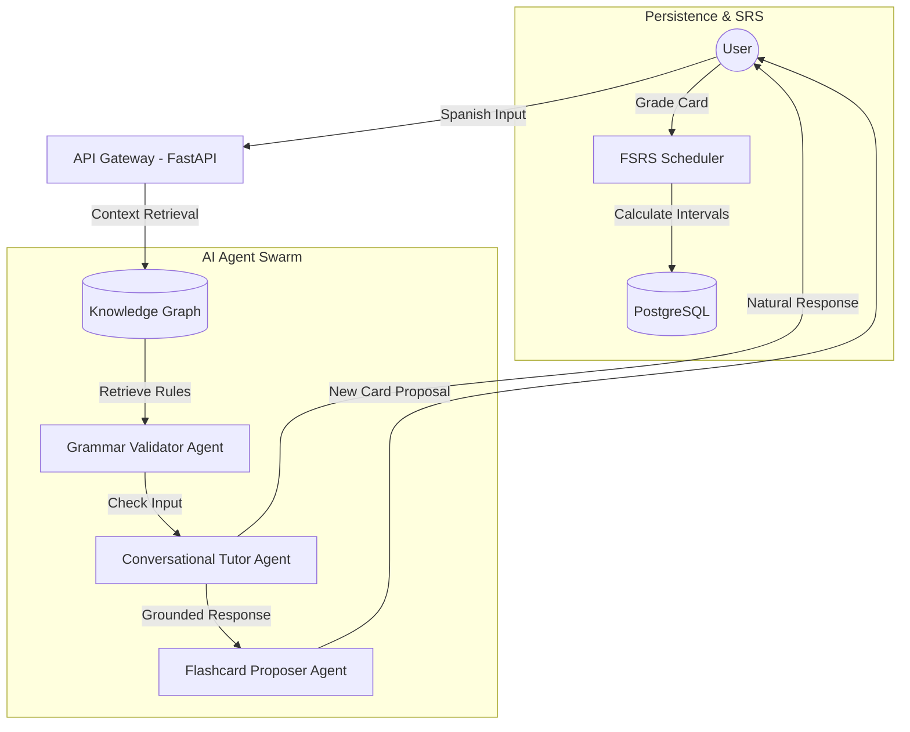

# Hola, I'm Tom Stehling 👋

### Software Engineer | AI Agent Architect | Language Tech Enthusiast

I build systems that bridge the gap between **Generative AI** and **structured pedagogical logic**. My current focus is on developing sophisticated AI Agents grounded by Knowledge Graphs to solve complex, domain-specific problems—starting with language acquisition.

---

## 🚀 Featured Project: AnkiXParlaI

AnkiXParlaI is a fullstack ecosystem designed to transition language learners from passive recognition to active fluency using **grounded AI agents**.

### 🧠 The Core: Spanish Grammar Knowledge Graph
To move beyond the "hallucination" risks of standard LLMs, I built a custom **Knowledge Graph** of Spanish grammar. This graph serves as the "source of truth" for my AI agents, mapping hierarchical relationships between:
*   **Verb Lemmas & Frequent Forms**
*   **Grammatical Tags** (CEFR-leveled)
*   **Learning Hacks** (Rules & Mnemonics)
*   **Prerequisite & Analogy Links**

#### The "Money Shot" - A Glimpse into the Graph:

---

## 🛠️ Agent Architecture & Data Flow

I specialize in designing **Agentic Workflows** where multiple specialized LLM instances collaborate, grounded by structured data.

### Multi-Agent Orchestration Flow
The diagram below illustrates how my system handles a user's Spanish input, grounding the response in the Knowledge Graph and updating the Spaced Repetition System (SRS).

### Why this matters for Recruiters:
*   **Grounding vs. Pure Generation:** I understand that for production AI, "vibe-based" generation isn't enough. My architecture uses RAG (Retrieval-Augmented Generation) combined with Graph logic to ensure pedagogical accuracy.
*   **Fullstack Orchestration:** I build the entire pipe—from the **Vue 3/Pinia** frontend to the **FastAPI** backend and the **SQLAlchemy** data layer.
*   **Algorithm Integration:** Implementation of modern algorithms like **FSRS** (Free Spaced Repetition Scheduler) shows my ability to integrate scientific research into functional software.

---

## 🧰 Technical Toolbox

*   **Languages:** Python (FastAPI, SQLAlchemy), TypeScript (Vue 3, Node.js), Go
*   **AI/LLM:** Gemini API, OpenAI/OpenRouter, Agentic Workflows, Prompt Engineering
*   **Data:** PostgreSQL (Supabase), Redis, Knowledge Graph Design (JSON/Relational)
*   **DevOps:** Docker, Google Cloud Platform (Cloud Run, Cloud Build), Git/CI-CD

---

## 📫 Let's Connect!

I am actively looking for opportunities where I can apply my experience in **AI Orchestration** and **Fullstack Engineering**.

*   **GitHub:** [ankixparlaibackend](https://github.com/tomstehling/ankixparlaibackend) | [ankixparlaifrontend](https://github.com/tomstehling/ankixparlaifrontend)
*   **Project Site:** [ankixparlai.com](https://ankixparlai.com) (In Development)

---
*Created with the help of my personalized AI engineering agent.*
