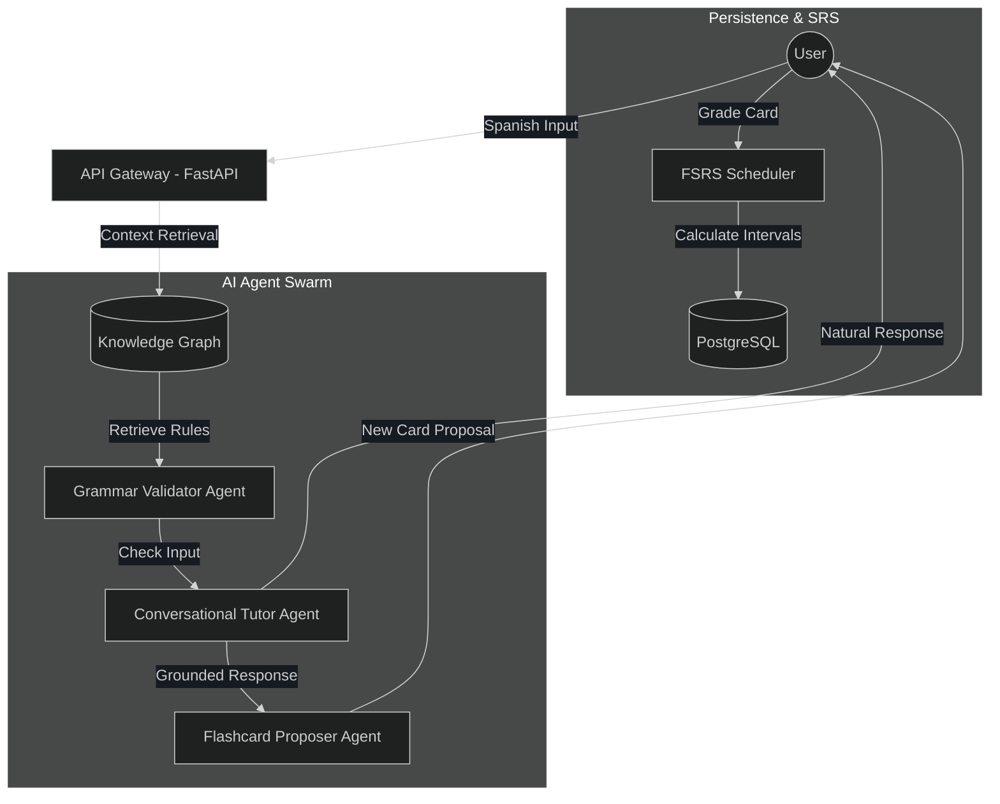

# Hola, I'm Tom Stehling 👋

### Software Engineer | AI Agent Architect | Language Tech Enthusiast

I build systems that bridge the gap between **Generative AI** and **structured pedagogical logic**. My current focus is on developing sophisticated AI Agents grounded by Knowledge Graphs to solve complex, domain-specific problems—starting with language acquisition.

---

## 🚀 Featured Project: AnkiXParlaI

AnkiXParlaI is a fullstack ecosystem designed to transition language learners from passive recognition to active fluency using **grounded AI agents**.

> **Current Status:** Architectural Design (100%) | Implementation (Active Development)
> *Current sprint: Implementing multi-agent state-machine logic and refining FSRS integration.*

### 🧠 The Core: Spanish Grammar Knowledge Graph
To move beyond the "hallucination" risks of standard LLMs, I built a custom **Knowledge Graph** of Spanish grammar. This graph serves as the "source of truth" for my AI agents.

*   **Implementation:** Relational Graph Modeling via adjacency lists in **PostgreSQL**, optimized for traversal using **SQLAlchemy** and recursive querying.
*   **Entity Mapping:** Hierarchical relationships between Verb Lemmas, Grammatical Tags (CEFR-leveled), and "Learning Hacks" (Rules & Mnemonics).

#### The "Money Shot" - A Glimpse into the Graph:
<picture>
  <source media="(prefers-color-scheme: dark)" srcset="./grounding_graph.png">
  <source media="(prefers-color-scheme: light)" srcset="./grounding_graph.png">
  
</picture>

---

## 🛠️ Agent Architecture & Data Flow

I specialize in designing **Agentic Workflows** where multiple specialized LLM instances collaborate, grounded by structured data.

### Multi-Agent Orchestration Flow
The system utilizes a **custom state-machine coordination layer** to manage handoffs between specialized agents, ensuring deterministic transitions and robust error handling.

### Agentic RAG in Action: A Walkthrough
1.  **Retrieval:** When a user submits Spanish text, the system identifies verb lemmas and grammatical structures.
2.  **Grounding:** The **Validator Agent** calls a specialized tool to fetch "Learning Hacks" (rules) and "Grammar Tags" associated with those lemmas from the Knowledge Graph.
3.  **Validation:** Instead of relying on LLM internal knowledge, the Agent compares the user's input against the *retrieved pedagogical rules* to identify specific errors.
4.  **Feedback:** The **Tutor Agent** synthesizes a natural response based on the validation report, while the **Proposer Agent** generates targeted flashcards to bridge identified gaps.

---

## 🧰 Technical Toolbox

*   **Languages:** Python (FastAPI, SQLAlchemy), TypeScript (Vue 3, Node.js), Go
*   **AI/LLM:** Gemini API, OpenAI/OpenRouter, Agentic Workflows, Prompt Engineering
*   **Data:** PostgreSQL (Supabase), Redis, Knowledge Graph Design (Relational/JSONB)
*   **DevOps:** Docker, Google Cloud Platform (Cloud Run, Cloud Build), Git/CI-CD

---

## 📫 Let's Connect!

I am actively looking for opportunities where I can apply my experience in **AI Orchestration** and **Fullstack Engineering**.

*   **GitHub:** [ankixparlaibackend](https://github.com/tomstehling/ankixparlaibackend) | [ankixparlaifrontend](https://github.com/tomstehling/ankixparlaifrontend)
*   **Project Site:** [ankixparlai.com](https://ankixparlai.com) (In Development)

---
*Created with the help of my personalized AI engineering agent.*