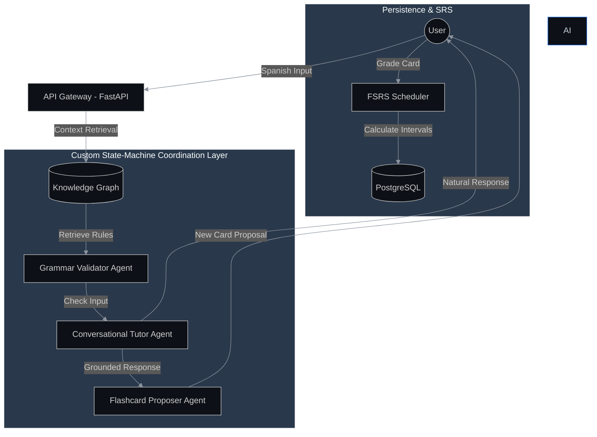

# Hola, I'm Tom Stehling 👋
### Software Engineer | AI Agent Architect | Language Tech Enthusiast

I build systems that bridge the gap between **Generative AI** and **structured pedagogical logic**. My focus is on developing AI Agents grounded by Knowledge Graphs to solve complex problems—starting with language acquisition.

---

## 🚀 Featured Project: AnkiXParlaI

**Status:** Implementation (Active Development)  
**Current Sprint:** Multi-agent state-machine logic & FSRS integration

### 🧠 The Core: Spanish Grammar Knowledge Graph
A custom Knowledge Graph serving as the "source of truth" for AI agents, preventing hallucination through Relational Graph Modeling.

<picture>
  <source media="(prefers-color-scheme: dark)" srcset="./grounding_graph.png">
  <source media="(prefers-color-scheme: light)" srcset="./grounding_graph.png">
  
</picture>

---

## 🛠️ Agent Architecture & Orchestration

Utilizing a **custom state-machine coordination layer** to manage handoffs between specialized agents, ensuring deterministic transitions and robust error handling.

### 🔍 Agentic RAG: How it works
*   **Retrieval:** identifies verb lemmas and grammatical structures from user input.
*   **Grounding:** The **Validator Agent** fetches "Learning Hacks" and rules from the PostgreSQL Knowledge Graph.
*   **Validation:** The agent compares the user's input against these rules to identify specific pedagogical errors.
*   **Feedback:** The **Tutor Agent** synthesizes a grounded response while the **Proposer Agent** generates targeted flashcards.

---

### 🧰 Technical Toolbox
*   **Languages:** Python (FastAPI, SQLAlchemy), TypeScript (Vue 3, Node.js), Go
*   **AI/LLM:** Gemini API, OpenAI, Agentic Workflows, Prompt Engineering
*   **Data:** PostgreSQL (Relational/JSONB), Knowledge Graph Design
*   **DevOps:** Docker, GCP (Cloud Run, Cloud Build), Git/CI-CD

---

### 📫 Let's Connect!
*   **GitHub:** [ankixparlaibackend](https://github.com/tomstehling/ankixparlaibackend) | [ankixparlaifrontend](https://github.com/tomstehling/ankixparlaifrontend)
*   **Project Site:** [ankixparlai.com](https://ankixparlai.com) (In Development)

   
  <i>Created with the help of my personalized AI engineering agent.</i>

