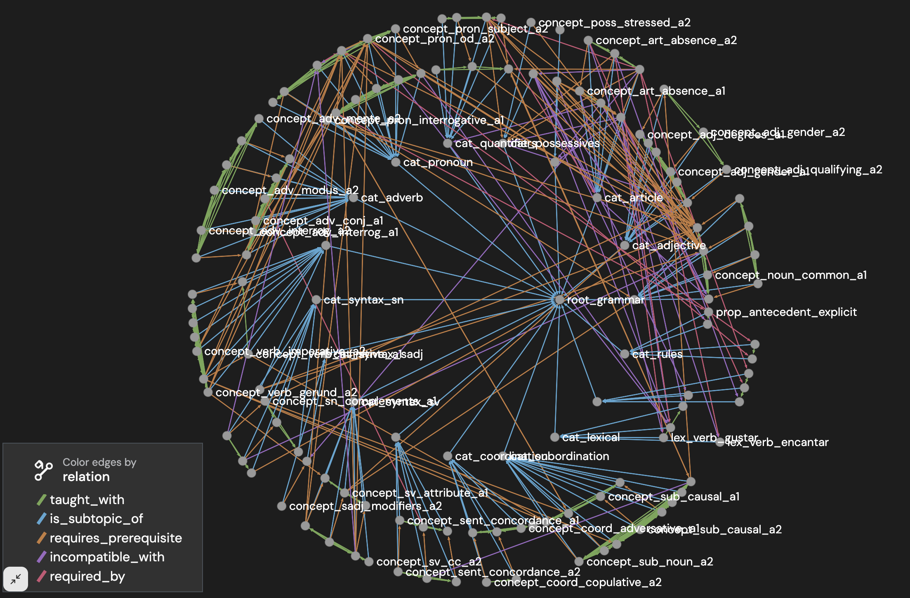
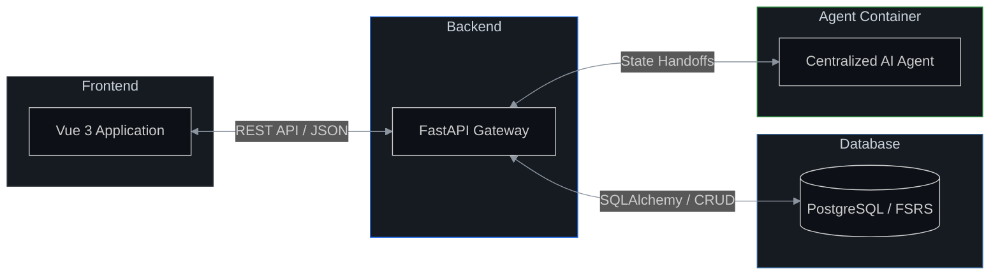
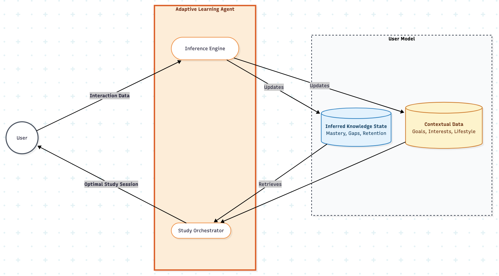
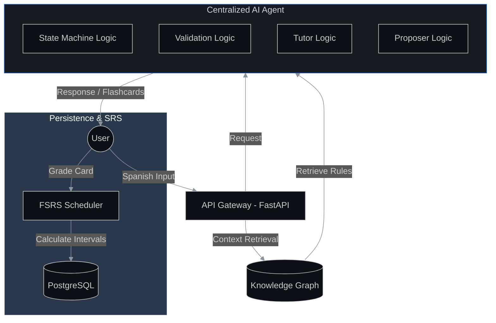

# 👋 Hi, I'm Tom — CS MSc student from Kiel/Germany
### Software Engineer | Tech Enthusiast  | Rising Applied AI Expert
Currently maxing out LLMs and exploring agentic systems.  🤖⚡
Open to collaborations on MCP or agentic tools!

---

## 🚀 Current Project: AnkiXParlaI
Want an ultra personalized language teacher? Try out my prototype! (english-spanish)
**[🌐 Live Demo](https://ankixparlai-frontend-380281608527.europe-southwest1.run.app/login)**

### 🧠 The Architecture
A custom Knowledge Graph serving as the "source of truth" for AI agents, preventing hallucination through Relational Graph Modeling.

<picture>
  <source media="(prefers-color-scheme: dark)" srcset="./grounding_graph.png">
  <source media="(prefers-color-scheme: light)" srcset="./grounding_graph.png">
  
</picture>

---

## 🔄 System Data Flow

A high-level overview of the ecosystem's communication architecture. Note that the **Agent Container** is isolated, communicating exclusively with the **Backend** to ensure secure and structured data handling.

---

## 🛠️ Agent Architecture & Orchestration

<picture>
  <source media="(prefers-color-scheme: dark)" srcset="./architecture.png">
  <source media="(prefers-color-scheme: light)" srcset="./architecture.png">
  
</picture>

Utilizing a **custom state-machine** to manage the logic and transitions of the **Centralized AI Agent**, ensuring deterministic processing and robust error handling.

### 🔍 Agentic RAG: How it works
*   **Retrieval:** identifies verb lemmas and grammatical structures from user input.
*   **Grounding:** The **Validator Agent** fetches "Learning Hacks" and rules from the PostgreSQL Knowledge Graph.
*   **Validation:** The agent compares the user's input against these rules to identify specific pedagogical errors.
*   **Feedback:** The **Tutor Agent** synthesizes a grounded response while the **Proposer Agent** generates targeted flashcards.

---

### 🧰 Technical Toolbox
*   **Languages:** Python (FastAPI, SQLAlchemy), TypeScript (Vue 3, Node.js), Go
*   **AI/LLM:** Gemini API, OpenAI, Agentic Workflows, Prompt Engineering
*   **Data:** PostgreSQL (Relational/JSONB), Knowledge Graph Design
*   **DevOps:** Docker, GCP (Cloud Run, Cloud Build), Git/CI-CD

---

### 📫 Let's Connect!
*   **GitHub:** [ankixparlaibackend](https://github.com/tomstehling/ankixparlaibackend) | [ankixparlaifrontend](https://github.com/tomstehling/ankixparlaifrontend)
*   **Project Site:** [ankixparlai.com](https://ankixparlai.com) (In Development)

   
  <i>Created with the help of my personalized AI engineering agent.</i>

