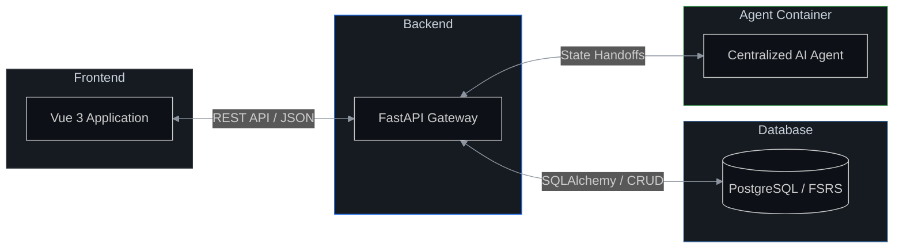

# 👋 Hi, I'm Tom — CS MSc student from Kiel/Germany
### Software Engineer | Tech Enthusiast  | Rising Applied AI Expert
Currently maxing out LLMs and exploring agentic systems.  🤖⚡
Open to collaborations on MCP or agentic tools!

---

## 🚀 Current Project: AnkiXParlaI
# 🚨 TRY HERE ➡️ 

Want an ultra personalized language teacher? Try out my prototype! (english-spanish)

### 🧠 The Architecture

<picture>
  <source media="(prefers-color-scheme: dark)" srcset="./architecture.png">
  <source media="(prefers-color-scheme: light)" srcset="./architecture.png">
  
</picture>

The duality of an adaptive learning system: The system continuously asseses the students knowledge to build an accurate model, that is then used to provide an optimal next learning step. 

## 🧭 Relational Graph Modeling

To get a ultra personalized learning experience, the system uses a dynamic curriculum. To ensure factual accuracy the agent uses a Knowledge Graph to retreive information from the "source of truth". This prevents hallucinations and supports long term goal cohearence. The graph is based on current language pedagogy principles thus leveraging the knowledge of decades of language learning.
<picture>
  <source media="(prefers-color-scheme: dark)" srcset="./grounding_graph.png">
  <source media="(prefers-color-scheme: light)" srcset="./grounding_graph.png">
  
</picture>

---

## 🔄 System Data Flow

A high-level overview of the ecosystem's communication architecture. Note that the **Agent Container** is isolated, communicating exclusively with the **Backend** to ensure secure and structured data handling.

### 🔍 Agentic RAG: How it works
*   **Retrieval:** identifies verb lemmas and grammatical structures from user input.
*   **Grounding:** The **Validator Agent** fetches "Learning Hacks" and rules from the PostgreSQL Knowledge Graph.
*   **Validation:** The agent compares the user's input against these rules to identify specific pedagogical errors.
*   **Feedback:** The **Tutor Agent** synthesizes a grounded response while the **Proposer Agent** generates targeted flashcards.

---

### 🧰 Technical Toolbox
*   **Languages:** Python (FastAPI, SQLAlchemy), TypeScript (Vue 3, Node.js), Go
*   **AI/LLM:** Gemini API, OpenAI, Agentic Workflows, Prompt Engineering
*   **Data:** PostgreSQL (Relational/JSONB), Knowledge Graph Design
*   **DevOps:** Docker, GCP (Cloud Run, Cloud Build), Git/CI-CD

---

### 📫 Let's Connect!
*   **GitHub:** [ankixparlaibackend](https://github.com/tomstehling/ankixparlaibackend) | [ankixparlaifrontend](https://github.com/tomstehling/ankixparlaifrontend)
*   **Project Site:** [ankixparlai.com](https://ankixparlai.com) (In Development)

   
  <i>Created with the help of my personalized AI engineering agent.</i>

