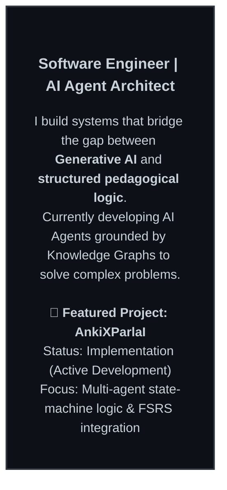
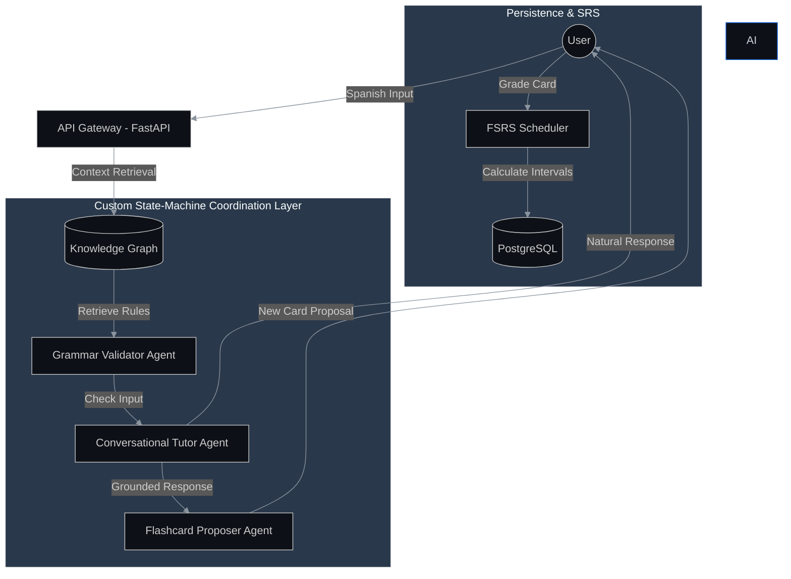
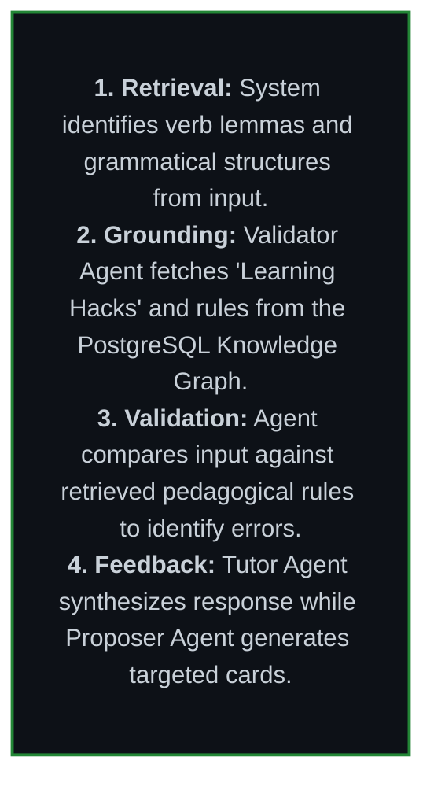

# Hola, I'm Tom Stehling 👋

### 🧠 The Core: Spanish Grammar Knowledge Graph
<picture>
  <source media="(prefers-color-scheme: dark)" srcset="./grounding_graph.png">
  <source media="(prefers-color-scheme: light)" srcset="./grounding_graph.png">
  
</picture>

### 🛠️ Agent Architecture & Orchestration

### 🔍 Agentic RAG in Action: A Walkthrough

---

## 🧰 Technical Toolbox

*   **Languages:** Python (FastAPI, SQLAlchemy), TypeScript (Vue 3), Go
*   **AI/LLM:** Gemini API, OpenAI, Agentic Workflows, Prompt Engineering
*   **Data:** PostgreSQL (Relational/JSONB), Knowledge Graph Design
*   **DevOps:** Docker, GCP (Cloud Run, Cloud Build), CI-CD

---

## 📫 Let's Connect!

*   **GitHub:** [ankixparlaibackend](https://github.com/tomstehling/ankixparlaibackend) | [ankixparlaifrontend](https://github.com/tomstehling/ankixparlaifrontend)
*   **Project Site:** [ankixparlai.com](https://ankixparlai.com) (In Development)

---
*Created with the help of my personalized AI engineering agent.*