# Hola, I'm Tom Stehling 👋

```mermaid
%%{init: {
  'theme': 'dark',
  'themeVariables': {
    'primaryColor': '#1f6feb',
    'primaryTextColor': '#c9d1d9',
    'primaryBorderColor': '#30363d',
    'lineColor': '#8b949e',
    'secondaryColor': '#161b22',
    'tertiaryColor': '#0d1117',
    'mainBkg': '#0d1117'
  }
} }%%

graph TD
    %% Main Profile Card
    subgraph Profile ["Tom Stehling | AI Agent Architect"]
        direction TB
        Bio["Software Engineer focused on bridging GenAI & Pedagogical Logic.<br/>Architecting systems grounded by Knowledge Graphs."]
    end

    %% Project Status & Tech
    subgraph Project ["🚀 Featured Project: AnkiXParlaI"]
        direction TB
        Status["<b>Status:</b> Active Development (Implementation Phase)<br/><b>Sprint:</b> Multi-agent state-machine & FSRS integration"]
        Stack["<b>Stack:</b> FastAPI, Vue 3, PostgreSQL, Gemini API"]
    end

    %% Knowledge Graph Details
    subgraph Core ["🧠 The Core: Spanish Grammar Knowledge Graph"]
        direction TB
        KG["Relational Graph Modeling (Adjacency Lists in PostgreSQL)<br/>Optimized via SQLAlchemy & Recursive Querying"]
    end

    %% Architecture Flow
    subgraph Architecture ["🛠️ Agentic Orchestration"]
        direction TB
        Flow["Custom State-Machine Coordination Layer<br/>Deterministic Handoffs | Robust Error Handling"]
    end

    %% RAG Walkthrough
    subgraph RAG ["🔍 Agentic RAG Walkthrough"]
        direction TB
        Step1["1. Retrieval: Identify Verb Lemmas via Input"]
        Step2["2. Grounding: Fetch 'Learning Hacks' from Knowledge Graph"]
        Step3["3. Validation: Validator Agent checks input against retrieved rules"]
        Step4["4. Feedback: Tutor Agent synthesizes grounded response"]
    end

    Bio --> Project
    Project --> Core
    Core --> Architecture
    Architecture --> RAG

    %% Styling
    style Profile fill:#161b22,stroke:#30363d,color:#58a6ff,stroke-width:2px
    style Project fill:#0d1117,stroke:#1f6feb,color:#c9d1d9
    style Core fill:#0d1117,stroke:#1f6feb,color:#c9d1d9
    style Architecture fill:#0d1117,stroke:#1f6feb,color:#c9d1d9
    style RAG fill:#0d1117,stroke:#238636,color:#c9d1d9
    
    classDef default font-family:Arial,font-size:14px;
```

### 🧠 Grounding Graph Visualization
<picture>
  <source media="(prefers-color-scheme: dark)" srcset="./grounding_graph.png">
  <source media="(prefers-color-scheme: light)" srcset="./grounding_graph.png">
  
</picture>

---

## 🧰 Technical Toolbox

*   **Languages:** Python (FastAPI, SQLAlchemy), TypeScript (Vue 3), Go
*   **AI/LLM:** Gemini API, OpenAI, Agentic Workflows, Prompt Engineering
*   **Data:** PostgreSQL (Relational/JSONB), Knowledge Graph Design
*   **DevOps:** Docker, GCP (Cloud Run, Cloud Build), CI-CD

---

## 📫 Let's Connect!

*   **GitHub:** [ankixparlaibackend](https://github.com/tomstehling/ankixparlaibackend) | [ankixparlaifrontend](https://github.com/tomstehling/ankixparlaifrontend)
*   **Project Site:** [ankixparlai.com](https://ankixparlai.com) (In Development)

---
*Created with the help of my personalized AI engineering agent.*